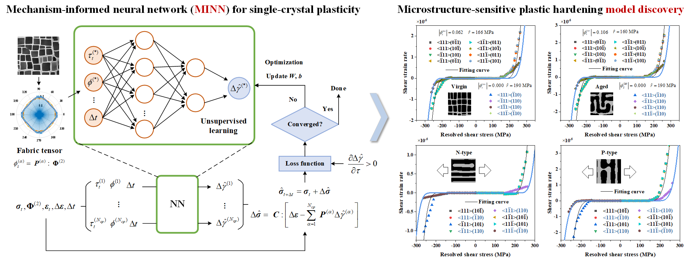

# Unsupervised-mechanism-informed-neural-network-for-single-crystal-plasticity
A newly developed neural network for single crystal plasticity model discovery.

## How to start
The code runs under Python 3.8 and PyTorch 2.0. Given the small amount of data, training and evaluation can be completed using a CPU.
Running the `main.py` program will execute the code. Select an appropriate network architecture. Set `self.FTcomp = []` for networks that do not consider microstructures; for networks that incorporate microstructures, select suitable components of the fabric tensor decomposition, such as `self.FTcomp=['phi_s_iso', 'phi_s_dev']`.


## Citation
```python
If the code is helpful to you, please cite the following papers.
@article{weng2025MINN,
  title={Unsupervised Mechanism-Informed Neural Network Modeling of Plastic Hardening in Rafted Ni-Based Single Crystals},
  author={Weng, Huanbo and Luo, Cheng and Yuan, Huang},
  journal={International Journal of Plasticity},
  pages = {104507},
  year={2025},
  doi = {https://doi.org/10.1016/j.ijplas.2025.104507},
  publisher={Elsevier}
}

@article{weng2025physics,
  title={Physics-informed neural network for constitutive modeling of cyclic crystal plasticity considering deformation mechanism},
  author={Weng, Huanbo and Bamer, Franz and Luo, Cheng and Markert, Bernd and Yuan, Huang},
  journal={International Journal of Mechanical Sciences},
  pages={110491},
  year={2025},
  doi = {https://doi.org/10.1016/j.ijmecsci.2025.110491},
  publisher={Elsevier}
}
```

## Contact
If you have any questions, please contact wenghb21@mails.tsinghua.edu.cn / wenghuanbo@163.com
